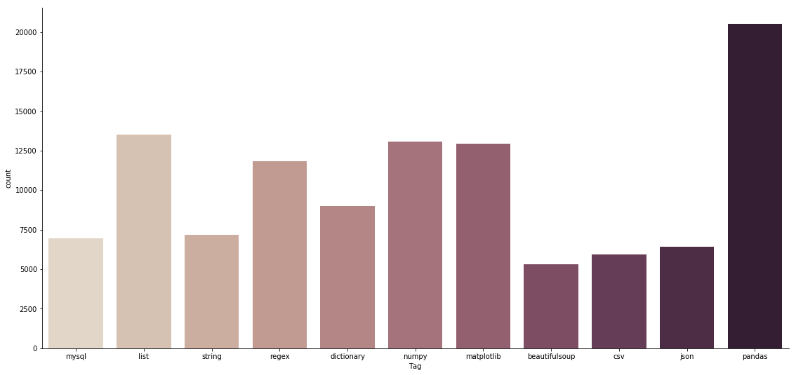
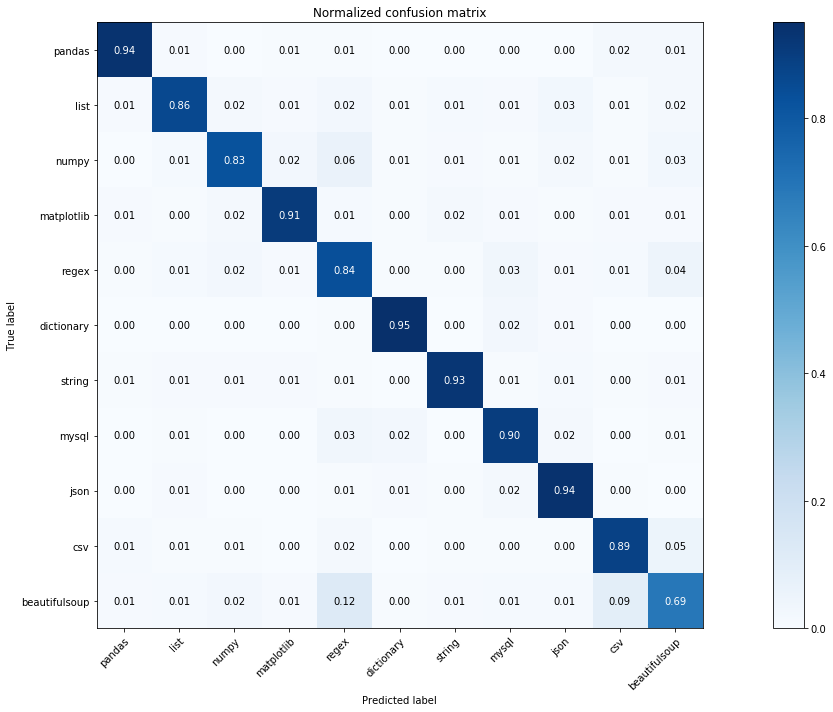

## NOTE  
#### Original files for the project exceed GitHub's maximum file size limit. Click on the link below to access complete code and data files for the
#### project.

LINK: https://drive.google.com/open?id=1gEbe5F8N_S7Adk-vE3nAFDGBuGDukw8i

## Initial Setup


```python
from imports import *
```

    Using TensorFlow backend.


```python
#Import sc class which contains all the functions for operating the stackClassifier
from stackClassifier import sc
```

## Python Stack Overflow Questions Tags being Classified

#### 1: pandas
#### 2: list
#### 3: numpy
#### 4: matplotlib
#### 5: regex
#### 6: dictionary
#### 7: string
#### 8: mysql
#### 9: json
#### 10: csv
#### 11: beautifulsoup


## Initialize Stack Classifier


```python
# We have already preprocessed the dataframe and saved it as a pickle file called 'processed_df' for faster execution
# If the preprocessed dataframe doesnot exist set load = False inorder to create a new one
stack_classifier = sc(load = True)
```

#### Total number of observations


```python
len(stack_classifier.df)
```


    112661


#### Visualizing distribution of Tags in the dataset


```python
ax = sns.catplot(x='Tag', kind="count", palette="ch:.25", data=stack_classifier.df)
ax.fig.set_size_inches(18,8)
```





## Load Model

The best performing neural network with 512 nodes in first hidden layer and 64 nodes in the second hidden layer has already been created and saved as 'tag_classifier.h5' to save executation time. You can train a new neural network by calling the 'train_neural_network' function.


```python
model = stack_classifier.load_neural_network('tag_classifier')
```

    WARNING: Logging before flag parsing goes to stderr.
    W0917 16:23:20.661309 4429637056 deprecation_wrapper.py:119] From /anaconda3/lib/python3.7/site-packages/keras/backend/tensorflow_backend.py:517: The name tf.placeholder is deprecated. Please use tf.compat.v1.placeholder instead.
    
    W0917 16:23:20.674825 4429637056 deprecation_wrapper.py:119] From /anaconda3/lib/python3.7/site-packages/keras/backend/tensorflow_backend.py:4115: The name tf.random_normal is deprecated. Please use tf.random.normal instead.
    
    W0917 16:23:20.684943 4429637056 deprecation_wrapper.py:119] From /anaconda3/lib/python3.7/site-packages/keras/backend/tensorflow_backend.py:131: The name tf.get_default_graph is deprecated. Please use tf.compat.v1.get_default_graph instead.
    
    W0917 16:23:20.685856 4429637056 deprecation_wrapper.py:119] From /anaconda3/lib/python3.7/site-packages/keras/backend/tensorflow_backend.py:133: The name tf.placeholder_with_default is deprecated. Please use tf.compat.v1.placeholder_with_default instead.
    
    W0917 16:23:20.692325 4429637056 deprecation.py:506] From /anaconda3/lib/python3.7/site-packages/keras/backend/tensorflow_backend.py:3445: calling dropout (from tensorflow.python.ops.nn_ops) with keep_prob is deprecated and will be removed in a future version.
    Instructions for updating:
    Please use `rate` instead of `keep_prob`. Rate should be set to `rate = 1 - keep_prob`.
    W0917 16:23:21.306606 4429637056 deprecation_wrapper.py:119] From /anaconda3/lib/python3.7/site-packages/keras/backend/tensorflow_backend.py:174: The name tf.get_default_session is deprecated. Please use tf.compat.v1.get_default_session instead.
    
    W0917 16:23:22.659685 4429637056 deprecation_wrapper.py:119] From /anaconda3/lib/python3.7/site-packages/keras/optimizers.py:790: The name tf.train.Optimizer is deprecated. Please use tf.compat.v1.train.Optimizer instead.
    
    W0917 16:23:22.730759 4429637056 deprecation.py:323] From /anaconda3/lib/python3.7/site-packages/tensorflow/python/ops/math_grad.py:1250: add_dispatch_support.<locals>.wrapper (from tensorflow.python.ops.array_ops) is deprecated and will be removed in a future version.
    Instructions for updating:
    Use tf.where in 2.0, which has the same broadcast rule as np.where


## Evaluate Model


```python
#Get confusion matrix, classification report and accuracy score
cm, c_report, a_report = stack_classifier.evaluate_model_df(model, c_matrix = True, c_report= True, a_score= True, load = True)
```

#### Classficiation Report


```python
print(c_report)
```

                   precision    recall  f1-score   support
    
    beautifulsoup       0.91      0.94      0.92      1750
              csv       0.87      0.86      0.86      1946
       dictionary       0.88      0.83      0.85      3008
             json       0.89      0.91      0.90      2109
             list       0.82      0.84      0.83      4457
       matplotlib       0.94      0.95      0.94      4244
            mysql       0.91      0.93      0.92      2288
            numpy       0.89      0.90      0.90      4344
           pandas       0.94      0.94      0.94      6722
            regex       0.89      0.89      0.89      3910
           string       0.73      0.69      0.71      2401
    
        micro avg       0.89      0.89      0.89     37179
        macro avg       0.88      0.88      0.88     37179
     weighted avg       0.89      0.89      0.89     37179
    


#### Accuracy Score


```python
print(f'The Accuracy Score is: {a_report}')
```

    The Accuracy Score is: 0.8868985179805804


#### Confusion Matrix


```python
classes = list(stack_classifier.df.Tag.value_counts().to_dict().keys())

title = 'Normalized confusion matrix'

cm = cm.astype('float') / cm.sum(axis=1)[:, np.newaxis]

fig, ax = plt.subplots(figsize = (20,10))
im = ax.imshow(cm, interpolation='nearest', cmap=plt.cm.Blues)
ax.figure.colorbar(im, ax=ax)
# We want to show all ticks...
ax.set(xticks=np.arange(cm.shape[1]),
   yticks=np.arange(cm.shape[0]),
   # ... and label them with the respective list entries
   xticklabels=classes, yticklabels=classes,
   title=title,
   ylabel='True label',
   xlabel='Predicted label')

# Rotate the tick labels and set their alignment.
plt.setp(ax.get_xticklabels(), rotation=45, ha="right",
     rotation_mode="anchor")

# Loop over data dimensions and create text annotations.
fmt = '.2f'
thresh = cm.max() / 2.
for i in range(cm.shape[0]):
    for j in range(cm.shape[1]):
        ax.text(j, i, format(cm[i, j], fmt),
                ha="center", va="center",
                color="white" if cm[i, j] > thresh else "black")
fig.tight_layout()
```




